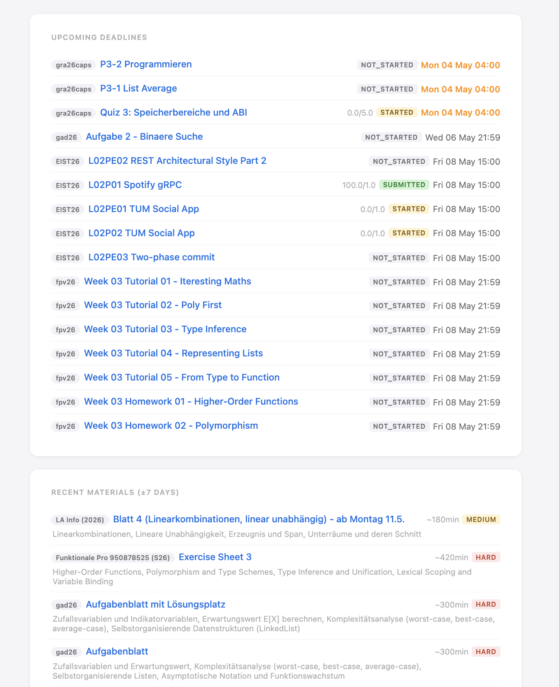
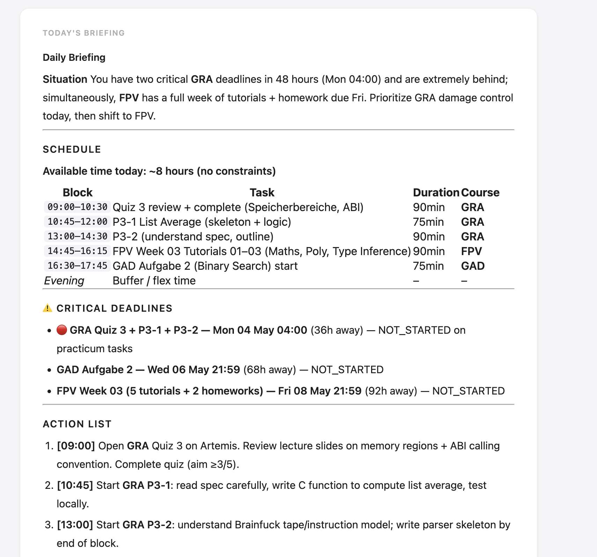

# TUMsolidator

Pulls Artemis assignments, Moodle course files, and the TUM Campus Calendar into a local SQLite database. Uses Claude Haiku to summarize downloaded PDFs and generates a daily study briefing.




## Setup

```bash
pip install -r requirements.txt
```

Create a `.env` file (see `.env.example`):

```env
ANTHROPIC_API_KEY=sk-ant-...
TUM_USERNAME=go42tum
TUM_PASSWORD=your-password
TUM_CALENDAR=https://campus.tum.de/tumonline/wbKalender.ical?...
```

`TUM_CALENDAR`: TUMOnline → Kalender → Persönlicher Kalender → iCal-Export.

Optional — richer notifications:

```bash
brew install terminal-notifier
```

Edit `state/context.md` to describe your current situation (courses, weak areas, progress). The daily briefing uses this to personalize recommendations.

## Usage

```bash
# Run full pipeline: sync all sources → summarize new PDFs → push briefing to Apple Notes
python main.py

# Run connectors individually
python -m connectors.artemis        # sync assignments + download lecture slides
python -m connectors.moodle         # sync and download Moodle course files
python -m connectors.campuscalendar # sync schedule for next 10 days

# Summarize newly downloaded PDFs (Claude Haiku via Files API)
python -m intelligence.summarize

# Generate and push daily briefing to Apple Notes
python -m intelligence.planner
```

## Sources

| Source | What it provides |
|---|---|
| Artemis | Assignments, submission status, scores, lecture slide attachments |
| Moodle | Course files and PDFs via Shibboleth SSO |
| TUM Campus Calendar | Personal schedule via ICS feed |

## How it works

```
connectors/
  artemis.py        → Artemis REST API  ──┐
  moodle.py         → Moodle HTML scrape  ├──→ storage/db.py (SQLite) ──→ intelligence/
  campuscalendar.py → ICS feed            ┘                                 summarize.py (Haiku)
                                                                             planner.py (Haiku)
storage/
  models.py         Event, Document dataclasses
  normalizer.py     source dicts → typed models
  db.py             SQLite CRUD (upsert, mark_processed, get_unprocessed)
  schema.sql        schema reference

state/
  data.db           SQLite database
  artemis_cookies.json
  moodle_cookies.json

resources/          downloaded course materials
  COURSE/
    LECTURE_ID/     Artemis lecture attachments
    SECTION/        Moodle module files

context.md          student context injected into daily briefing prompt
```

## Notifications

New file downloads trigger a macOS notification immediately. Uses `terminal-notifier` if installed, falls back to native `osascript`.
